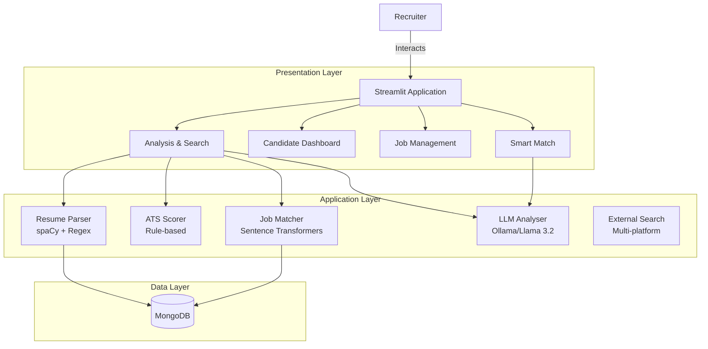
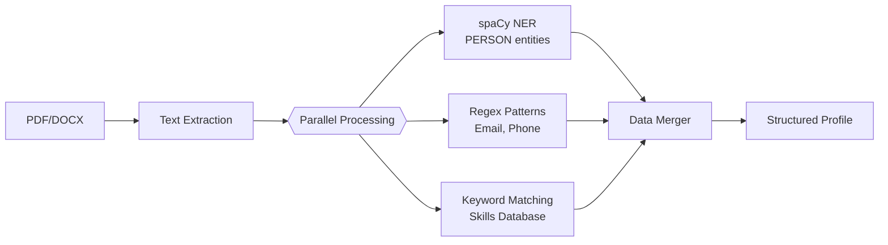
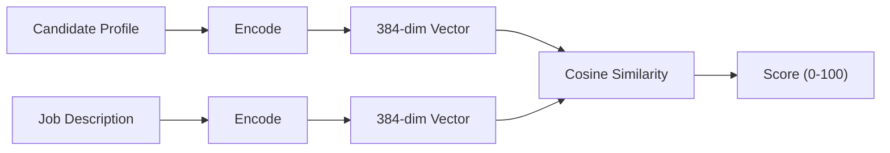
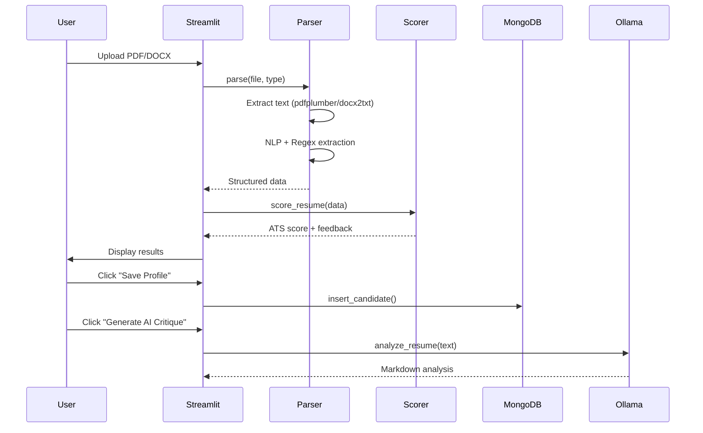
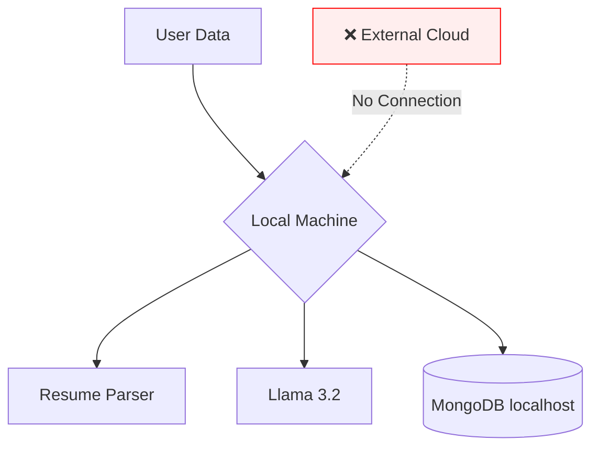

# AI-Driven Resume Analyzer

Technical Deep-Dive: NLP, Semantic Search & Local LLMs

---

## System Architecture Overview

### Layered, Modular Design



---

## Core Technology Stack

| Layer | Technology | Purpose |
|-------|------------|---------|
| **NLP** | spaCy `en_core_web_sm` | Named Entity Recognition, tokenization |
| **Embeddings** | `all-MiniLM-L6-v2` | 384-dim semantic vectors |
| **LLM** | Llama 3.2 via Ollama | Qualitative analysis, reasoning |
| **Data** | MongoDB | Flexible document storage |
| **UI** | Streamlit | Interactive web interface |
| **File Processing** | pdfplumber, docx2txt | Resume text extraction |

> **Privacy-First**: All processing runs locally—no external API calls

---

## Resume Parser: Hybrid Extraction

### Multi-Strategy Approach



**Key Techniques:**
- **spaCy NER**: Extracts `PERSON`, `ORG`, `PRODUCT` entities
- **Regex Patterns**: `r'[a-zA-Z0-9._%+-]+@[a-zA-Z0-9.-]+\.[a-zA-Z]{2,}'` for email
- **Fuzzy Skills Matching**: Case-insensitive search against 30+ skill keywords

---

## Name Extraction Algorithm

### Intelligent Header Parsing

The name extractor uses a 5-step heuristic algorithm:

1. **Header Focus**: Analyze only first 3 lines (typically contact area)
2. **Forbidden Words Filter**: Exclude skills, titles, and generic terms
3. **Word Count Check**: Names are usually 1-4 words
4. **NER Validation**: Confirm via spaCy `PERSON` entity
5. **Cross-Reference**: Prefer candidates matching both heuristic and NER

```python
# Forbidden words example
forbidden_words = {
    "resume", "cv", "profile", "senior", "engineer", 
    "developer", "manager", "lead", ...skill_list
}
```

---

## ATS Scoring System

### Rule-Based Evaluation (0-100)

| Criteria | Points | Implementation |
|----------|--------|----------------|
| **Contact Info** | 20 | Name (5) + Email (10) + Phone (5) |
| **Skills** | 25 | 5+ skills = 25, 1-4 = 15, 0 = 0 |
| **Sections** | 30 | Experience (15) + Education (15) |
| **Metrics** | 15 | Regex: `\d+%|\$\d+|\d+\s?(?:users|clients|revenue)` |
| **Format** | 10 | Word count 200-1000 = 10 |

**Feedback Generation**: Each missing criterion returns specific, actionable suggestions for improvement.

---

## Semantic Search: Sentence Transformers

### Beyond Keyword Matching

**Model**: `all-MiniLM-L6-v2`
- Output: 384-dimensional embeddings
- Optimized for semantic similarity tasks
- Inference: ~0.3s per text



**Why Semantic Search?**
"Python developer" matches "Software Engineer with Python experience" even without exact keyword overlap.

---

## Hybrid Matching Algorithm

### Combining Semantic + Keyword Scoring

```
1. Text Preparation:
   candidate_text = raw_text + " " + joined_skills
   job_text = description + " " + required_skills + " " + title

2. Semantic Score:
   cosine_similarity(embed(candidate), embed(job)) × 100

3. Keyword Boost:
   matched_skills = intersection(candidate.skills, job.required_skills)
   boost = (matched_skills / total_required_skills) × 20

4. Final Score:
   min(semantic_score + boost, 100)
```

**Example**: 65% semantic + 15% skill match = **80% final match score**

---

## Local LLM Integration: Ollama

### Privacy-Preserving AI Analysis

**Model**: Llama 3.2 (runs locally via Ollama)

**Three Analysis Functions:**

| Function | Purpose | Truncation |
|----------|---------|------------|
| `analyze_resume()` | Comprehensive critique | 3000 chars |
| `analyze_fit()` | Resume-to-job comparison | 3000 chars each |
| `extract_job_title()` | Title from JD text | 2000 chars |

**Key Advantage**: No data leaves the local machine—complete privacy control.

---

## LLM Prompt Engineering

### Structured Output via Persona Prompting

```markdown
**Resume Critique Prompt Structure:**

1. Persona: "Expert Resume Reviewer and Career Coach 
   with 15+ years experience"

2. Requested Sections:
   - Executive Summary (3-4 sentences)
   - Pros: Key Strengths (4-5 items with evidence)
   - Cons: Areas for Improvement (4-5 actionable items)
   - Recommended Career Paths (3-4 suggestions)
   - Action Items (3-5 immediate steps)

3. Instruction: "Reference actual content from the resume"
```

This engineering ensures consistent, structured, and actionable output.

---

## Database Design: MongoDB

### Flexible Document Schema

**Candidates Collection:**
```javascript
{
  "_id": ObjectId,
  "name": "John Doe - Software Engineer",  // Name - JobTitle format
  "email": "john@example.com",
  "phone": "+1234567890",
  "skills": ["Python", "Machine Learning", "AWS"],
  "job_title": "Software Engineer",
  "raw_text": "Full resume text...",
  "ats_score": 85,
  "ats_feedback": ["Add more metrics", "..."],
  "created_at": ISODate
}
```

**Jobs Collection**: title, department, description, required_skills, created_at

---

## External Job Search Engine

### Multi-Platform Integration

**Supported Platforms:**
- LinkedIn Jobs
- Indeed
- Glassdoor
- Google Jobs

**Smart Query Generation:**
```python
def recommend_jobs(
    skills: List[str],
    job_title: str = None,
    location: str = None,
    remote_only: bool = False,
    posted_last_24h: bool = False,
    limit: int = 10
) -> List[Dict]
```

**Features**: Auto-builds queries from candidate profile, HTML cleaning, deduplication

---

## Application Flow: Resume Processing



---

## Smart Match: Resume vs Job Fit

### AI-Powered Comparison

**Input Options:**
- Resume: Upload file OR paste text
- Job: Select from database OR paste description

**Analysis Pipeline:**
1. Parse resume (if file uploaded)
2. Call `analyze_fit(resume_text, job_description)`
3. Extract job title via `extract_job_title()`
4. Display structured fit report
5. Auto-search external job boards

**Output**: Match percentage, matching skills, skill gaps, experience alignment, recommendation

---

## Performance Characteristics

| Operation | Time | Notes |
|-----------|------|-------|
| **PDF Extraction** | ~0.5-1s | pdfplumber page iteration |
| **spaCy NLP** | ~0.5s | NER + tokenization |
| **ATS Scoring** | <0.1s | Rule evaluation |
| **Embedding Generation** | ~0.3s | Per text string |
| **Cosine Similarity** | <0.01s | Tensor operation |
| **LLM Analysis** | 5-15s | Depends on hardware |
| **MongoDB Insert** | <10ms | Local connection |

**Total Resume Processing**: < 2 seconds (excluding LLM)

---

## UI Architecture: Streamlit

### Four-Page Navigation

```
Sidebar Navigation
├── Analysis & Search
│   ├── Resume Upload (PDF/DOCX, 2MB limit)
│   ├── ATS Score Card (color-coded)
│   ├── AI Critique Tab
│   └── Job Matches Tab (Internal + External)
├── Candidate Dashboard
│   ├── Metrics Row (Total, Avg Score, Top Talent 80+)
│   └── Candidate Cards with View/Delete
├── Job Management
│   └── Create Job Form + Active Listings
└── Smart Match
    └── Resume vs Job Comparison + External Search
```

**Design System**: Inter font, card-based layout, responsive CSS, dark/light mode support

---

## Security & Privacy Model

### 100% Local Processing



**Key Security Features:**
- No external API calls for sensitive data
- MongoDB on localhost:27017 (no remote exposure)
- Ollama runs entirely locally
- File size validation (2MB limit)
- Input truncation (3000 chars for LLM)

---

## Deployment Architecture

### Local Development (Current)

```bash
# Prerequisites
Python 3.12+
MongoDB (port 27017)
Ollama + llama3.2 model

# Quick Start
uv sync
uv run python -m spacy download en_core_web_sm
ollama pull llama3.2
uv run streamlit run app.py
```

**Future Scaling Options:**
- GPU acceleration for embeddings
- MongoDB authentication & replication
- Ollama API server for shared LLM access
- Streamlit Cloud or Docker deployment

---

## Code Architecture Summary

```
resume-analyser/
├── app.py                     # Streamlit UI (626 lines)
├── src/
│   ├── parser.py             # spaCy + Regex extraction (214 lines)
│   ├── matcher.py            # Sentence Transformers matching (90 lines)
│   ├── llm_analyser.py       # Ollama interface (168 lines)
│   ├── scorer.py             # Rule-based ATS (129 lines)
│   ├── db.py                 # MongoDB CRUD operations
│   └── external_search.py    # Multi-platform job search
```

**Design Principles:**
- Separation of concerns (each module = single responsibility)
- Graceful error handling with user-friendly messages
- Type hints throughout codebase
- Modular, testable functions

---

## Key Technical Innovations

| Innovation | Implementation |
|------------|----------------|
| **Hybrid NER** | spaCy + Regex + Keywords for robust extraction |
| **Semantic Search** | Transformer embeddings capture meaning, not just keywords |
| **Hybrid Matching** | Semantic score + keyword boost for accuracy |
| **Local LLM** | Privacy-first AI without cloud dependencies |
| **Multi-source Jobs** | Unified search across LinkedIn, Indeed, Glassdoor |
| **Flexible Schema** | MongoDB adapts to evolving requirements |

**Result**: A production-ready, privacy-preserving recruitment platform combining classical NLP, modern transformers, and local LLMs.
