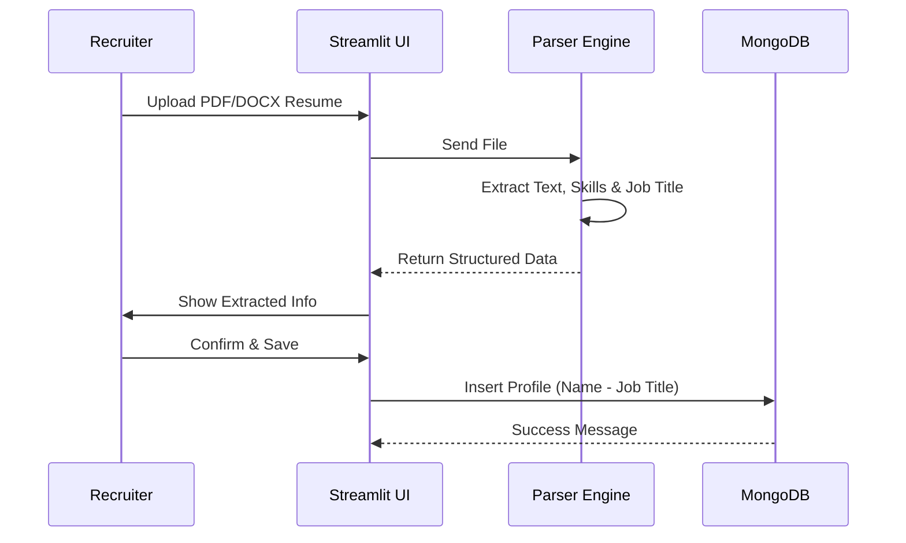
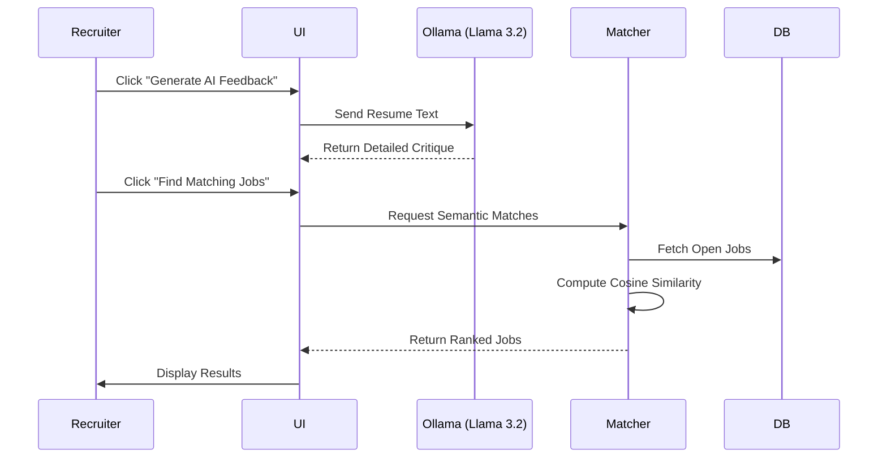

# Technical Specification: AI-Driven Resume Analyser

## 1. Problem Overview
Recruiters struggle with efficiently screening large volumes of resumes due to unstructured formats and manual processes. This leads to delays, bias, and missed opportunities. The goal is to build a local, AI-powered system to parse resumes, store structured data, and recommend jobs.

## 2. System Architecture
The system will be a local web application built with Streamlit. It follows a layered architecture:
- **Presentation Layer**: Streamlit UI for interaction (Professional styling, Dark/Light mode).
- **Application Layer**: 
    - **Parser**: spaCy & Regex for extraction.
    - **Matcher**: Sentence Transformers for semantic similarity.
    - **Analyser**: Local LLM (Ollama/Llama 3.2) for qualitative feedback.
- **Data Layer**: MongoDB for storing structured candidate and job data.

```mermaid
graph TD
    User[Recruiter] -->|Interacts| UI[Streamlit UI]
    UI -->|Uploads Resume| Parser[Resume Parser Engine]
    UI -->|Request Analysis| LLM[Local LLM (Ollama)]
    Parser -->|Extracts Data| Controller[Logic Controller]
    Controller -->|CRUD Operations| DB[(MongoDB)]
    Controller -->|Matches| Matcher[Semantic Matching Engine]
    Matcher -->|Reads| DB
    LLM -->|Generates Feedback| UI
```

## 3. User Flows

### 3.1 Resume Upload & Parsing


### 3.2 AI Analysis & Job Matching


## 4. Database Schema (MongoDB)

### 4.1 Collection: `candidates`
```json
{
  "_id": "ObjectId",
  "name": "String", // Format: "Name - Job Title"
  "email": "String",
  "phone": "String",
  "skills": ["String"],
  "job_title": "String", // Extracted job title
  "raw_text": "String",
  "ats_score": "Integer",
  "ats_feedback": ["String"],
  "created_at": "DateTime"
}
```

### 4.2 Collection: `jobs`
```json
{
  "_id": "ObjectId",
  "title": "String",
  "department": "String",
  "description": "String",
  "required_skills": ["String"],
  "created_at": "DateTime"
}
```

## 5. API / Interface Design
Internal Python Service Layer:

- `ResumeParser.parse(file_buffer) -> Dict`: Extracts text, entities, and job title.
- `JobMatcher.match_jobs(candidate_data, jobs) -> List[Dict]`: Semantic matching using embeddings.
- `LLMAnalyser.analyze_resume(text) -> str`: Generates qualitative feedback using local Ollama model.
- `Database.insert_candidate(data) -> id`: Saves profile with auto-formatted name.
- `Database.update_candidate_name(id, name)`: Renames candidate.
- `Database.delete_candidate(id)`: Removes candidate.

## 6. Streamlit UI Wireframes

### 6.1 Sidebar Navigation
- **Upload Resume**: Main parsing tool.
- **Candidate Dashboard**: View, search, edit, and delete profiles.
- **Job Management**: Post and manage job openings.

### 6.2 Candidate Dashboard
- **Metrics**: Total candidates, Avg Score, High Scorers.
- **List View**: 
    - Candidate Name (Clickable -> Detailed View).
    - ATS Score (Color-coded).
    - Actions: Edit Name, Delete.
- **Detail View**: Full profile, skills, raw text, and AI feedback.
