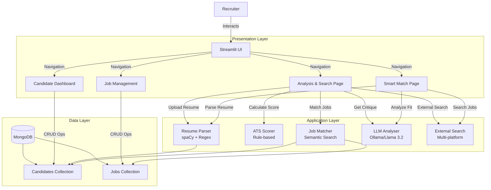
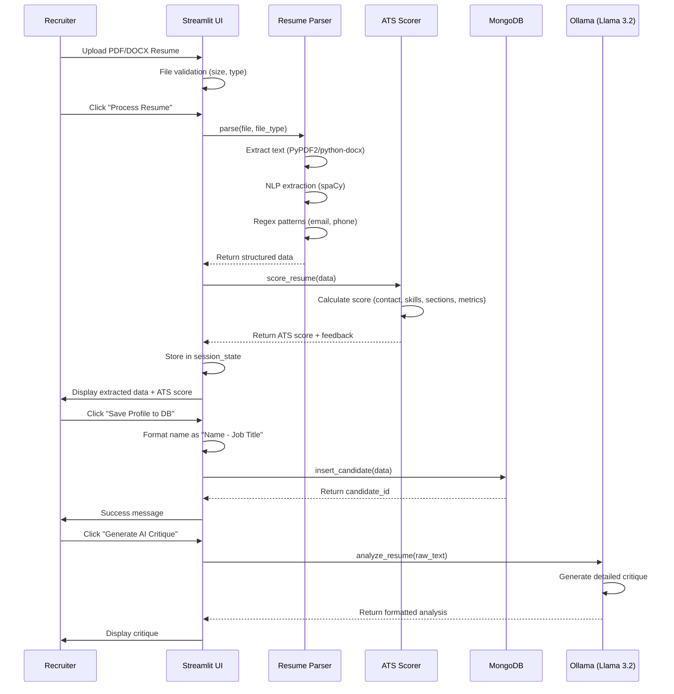
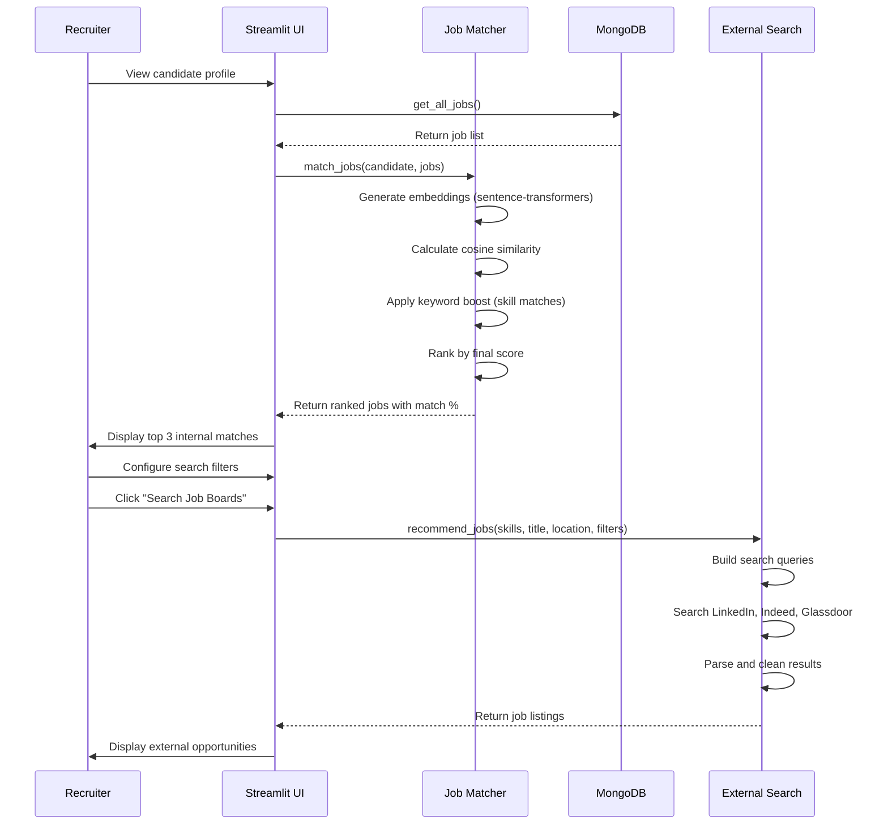
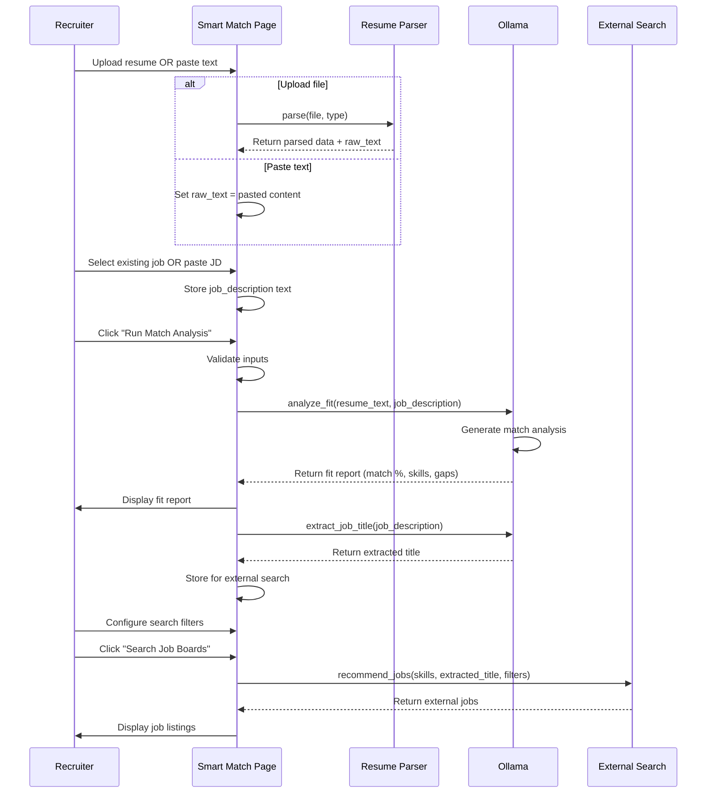

# Technical Specification: AI-Driven Resume Analyser

## 1. Problem Statement

Modern recruitment faces critical challenges:
- **Volume Overload**: Recruiters manually screen hundreds of resumes daily, creating bottlenecks
- **Unstructured Data**: Varying resume formats make consistent evaluation difficult
- **Inconsistent Screening**: Manual processes introduce bias and human error
- **Time Inefficiency**: Hours spent on initial screening that could be automated
- **Poor Matching**: Keyword-only matching misses semantically similar candidates

**Solution**: Build a local, AI-powered platform that automates resume parsing, provides objective ATS scoring, leverages semantic search for intelligent matching, and uses local LLMs for qualitative analysis—all while maintaining complete data privacy.

## 2. System Architecture

The application follows a clean, layered architecture with four main pages and modular components.

### 2.1 Architecture Diagram



### 2.2 Component Responsibilities

**Presentation Layer (Streamlit)**
- `app.py` (626 lines): Main application with 4 navigation pages
  - Analysis & Search: Resume upload, processing, AI critique, internal/external job matching
  - Candidate Dashboard: View all candidates, metrics, CRUD operations
  - Job Management: Create and view job postings
  - Smart Match: Compare any resume vs any job description with AI fit analysis
- Custom CSS for professional UI with Inter font, card-based design, responsive layout
- Session state management for resume data, search results, and selected candidates

**Application Layer (Python Modules)**
- `parser.py`: Resume parsing using spaCy NLP and regex patterns for entity extraction (name, email, phone, skills, job title)
- `scorer.py`: Rule-based ATS scoring (0-100) evaluating contact info, skills, sections, metrics, formatting
- `matcher.py`: Semantic job matching using sentence-transformers (all-MiniLM-L6-v2) with hybrid scoring
- `llm_analyser.py`: Ollama interface for three types of analysis:
  - `analyze_resume()`: Comprehensive resume critique with strengths, weaknesses, career paths
  - `analyze_fit()`: Resume-to-job fit assessment with match percentage and recommendations
  - `extract_job_title()`: Extract job title from unstructured job descriptions
- `external_search.py`: Multi-platform job search (LinkedIn, Indeed, Glassdoor, Google Jobs) with filters
- `db.py`: MongoDB wrapper with CRUD operations for candidates and jobs

**Data Layer (MongoDB)**
- Database: `resume_analyser`
- Collections: `candidates`, `jobs`
- Connection check on startup with user-friendly error messages

## 3. User Flows

### 3.1 Resume Upload & Analysis Flow



### 3.2 Job Matching Flow



### 3.3 Smart Match Flow



## 4. Database Schema

### 4.1 Candidates Collection

```javascript
{
  "_id": ObjectId,                          // Unique identifier
  "name": "String",                         // Format: "Name - Job Title"
  "email": "String",                        // Extracted email
  "phone": "String",                        // Extracted phone
  "skills": ["String"],                     // Array of extracted skills
  "job_title": "String",                    // Extracted current/target job title
  "raw_text": "String",                     // Full resume text
  "ats_score": Integer,                     // 0-100 score
  "ats_feedback": ["String"],               // Array of improvement suggestions
  "created_at": DateTime                    // Auto-generated timestamp
}
```

**Indexes:**
- `_id`: Primary index (auto-created)
- Recommended: Text index on `skills` and `raw_text` for future search features

### 4.2 Jobs Collection

```javascript
{
  "_id": ObjectId,                          // Unique identifier
  "title": "String",                        // Job title
  "department": "String",                   // Department/team
  "description": "String",                  // Full job description
  "required_skills": ["String"],            // Array of required skills
  "created_at": DateTime                    // Auto-generated timestamp
}
```

**Indexes:**
- `_id`: Primary index (auto-created)
- Recommended: Text index on `description` and `required_skills` for search

## 5. API / Service Layer Design

### 5.1 ResumeParser (src/parser.py)

```python
class ResumeParser:
    def __init__(self):
        """Loads spaCy model (en_core_web_sm)"""
        
    def parse(self, file_buffer, file_type: str) -> Dict:
        """
        Main parsing method.
        
        Args:
            file_buffer: Uploaded file object
            file_type: 'pdf' or 'docx'
        
        Returns:
            {
                'name': str,
                'email': str,
                'phone': str,
                'skills': List[str],
                'job_title': str,
                'raw_text': str
            }
        """
```

**Extraction Methods:**
- `extract_text_from_pdf()`: PyPDF2-based extraction
- `extract_text_from_docx()`: python-docx-based extraction
- `extract_name()`: spaCy NER for PERSON entities
- `extract_email()`: Regex pattern matching
- `extract_phone()`: Multiple regex patterns for various formats
- `extract_skills()`: Fuzzy matching against predefined skill database
- `extract_job_title()`: NER + pattern matching for job titles

### 5.2 ATSScorer (src/scorer.py)

```python
class ATSScorer:
    def score_resume(self, data: Dict) -> Dict:
        """
        Calculates ATS score (0-100) based on:
        - Contact Info (20 pts): Name, Email, Phone
        - Skills (25 pts): Quantity and presence
        - Sections (30 pts): Experience, Education
        - Metrics (15 pts): Quantifiable achievements
        - Format (10 pts): Word count (200-1000)
        
        Returns:
            {
                'ats_score': int,
                'feedback': List[str],
                'found_sections': List[str]
            }
        """
```

### 5.3 JobMatcher (src/matcher.py)

```python
class JobMatcher:
    def __init__(self):
        """Loads sentence-transformers model (all-MiniLM-L6-v2)"""
        
    def calculate_similarity(self, text1: str, text2: str) -> float:
        """
        Computes cosine similarity between two texts.
        
        Returns: float (0-100)
        """
        
    def match_jobs(self, candidate: Dict, jobs: List[Dict]) -> List[Dict]:
        """
        Hybrid matching algorithm:
        1. Generate embeddings for candidate and jobs
        2. Calculate cosine similarity (semantic score)
        3. Add keyword boost for exact skill matches (+20%)
        4. Return ranked list with match_score field
        
        Returns: List of jobs sorted by match_score (desc)
        """
```

### 5.4 LLMAnalyser (src/llm_analyser.py)

```python
class LLMAnalyser:
    def __init__(self):
        """Sets model to 'llama3.2' for Ollama"""
        
    def analyze_resume(self, resume_text: str) -> str:
        """
        Generates comprehensive resume critique.
        
        Returns markdown-formatted analysis with:
        - Executive Summary
        - Pros (Key Strengths)
        - Cons (Areas for Improvement)
        - Recommended Career Paths
        - Action Items
        """
        
    def analyze_fit(self, resume_text: str, job_description: str) -> str:
        """
        Analyzes candidate-job fit.
        
        Returns markdown-formatted report with:
        - Match Score (0-100%)
        - Key Matching Skills
        - Missing Critical Skills
        - Experience Alignment
        - Final Recommendation
        """
        
    def extract_job_title(self, job_description: str) -> str:
        """Extracts job title from unstructured JD text"""
```

### 5.5 Database (src/db.py)

```python
class Database:
    def __init__(self):
        """Connects to MongoDB (resume_analyser database)"""
        
    def check_connection(self) -> bool:
        """Validates MongoDB is running"""
        
    # Candidate Operations
    def insert_candidate(self, data: Dict) -> ObjectId
    def get_all_candidates(self) -> List[Dict]
    def update_candidate_name(self, id: str, new_name: str) -> UpdateResult
    def delete_candidate(self, id: str) -> DeleteResult
    
    # Job Operations
    def insert_job(self, data: Dict) -> ObjectId
    def get_all_jobs(self) -> List[Dict]
```

### 5.6 ExternalJobSearch (src/external_search.py)

```python
class ExternalJobSearch:
    def recommend_jobs(
        self,
        skills: List[str],
        job_title: str = None,
        location: str = None,
        remote_only: bool = False,
        posted_last_24h: bool = False,
        limit: int = 10
    ) -> List[Dict]:
        """
        Searches multiple job platforms.
        
        Returns:
            List[{
                'title': str,
                'snippet': str (HTML-cleaned),
                'link': str,
                'location': str,
                'is_remote': bool
            }]
        """
```

## 6. UI Design

### 6.1 Navigation Structure

```
Sidebar Navigation
├── Analysis & Search
│   ├── Resume Upload Section
│   ├── ATS Score Summary Card
│   ├── AI Critique Tab
│   ├── Internal Matches Tab
│   └── External Search Tab
├── Candidate Dashboard
│   ├── Metrics Row (Total, Avg Score, Top Talent)
│   ├── Candidate Cards Grid
│   └── Profile Detail Modal
├── Job Management
│   ├── Create Job Form
│   └── Active Listings Display
└── Smart Match
    ├── Resume Source (Upload/Paste)
    ├── Job Target (Select/Paste)
    ├── Fit Report Display
    └── External Search Integration
```

### 6.2 Page Layouts

**Analysis & Search**
- Two-column layout: Upload (left) + Summary (right)
- Three tabs below: AI Critique | Job & LinkedIn Matches | Raw Data
- Job matches split: Internal (left) + External (right)

**Candidate Dashboard**
- Metrics row with 3 KPI cards
- Scrollable candidate list with embedded View/Delete buttons
- Detail modal overlay for selected candidate

**Job Management**
- Top section: Job creation form (2-column for title/department)
- Bottom section: Active listings with card-based display

**Smart Match**
- Two-column input: Resume Source (left) + Job Target (right)
- Full-width fit report below
- External job search with filters and results

### 6.3 Design System

**Colors:**
- Primary: `#2563EB` (Blue)
- Success: `#10B981` (Green)
- Warning: `#F59E0B` (Amber)
- Error: `#EF4444` (Red)
- Background: `#F8FAFC` (Light gray)
- Card BG: `#FFFFFF` (White)

**Typography:**
- Font: Inter (Google Fonts)
- H1: 2.5rem, weight 700
- H2: 1.5rem, weight 700
- Body: 1rem, weight 400

**Components:**
- Cards: 12px border-radius, subtle shadow, hover transform
- Buttons: 8px border-radius, gradient on primary
- Inputs: 8px border-radius, focus ring
- Metrics: Large numbers with secondary labels

## 7. Algorithms & Technical Details

### 7.1 ATS Scoring Algorithm

```
Total Score = Contact (20) + Skills (25) + Sections (30) + Metrics (15) + Format (10)

Contact Info (20 points):
  - Name present: +5
  - Email present: +10
  - Phone present: +5

Skills (25 points):
  - 5+ skills: +25
  - 1-4 skills: +15
  - 0 skills: 0

Sections (30 points):
  - Experience section present: +15
  - Education section present: +15

Metrics (15 points):
  - Quantifiable achievements (%, $, numbers): +15
  - None found: 0

Format (10 points):
  - 200-1000 words: +10
  - <200 words: 0 (too short)
  - >1000 words: 0 (too long)
```

### 7.2 Semantic Matching Algorithm

```
1. Text Preparation:
   candidate_text = raw_text + " " + joined_skills
   job_text = description + " " + joined_required_skills + " " + title

2. Embedding Generation:
   candidate_embedding = model.encode(candidate_text)
   job_embedding = model.encode(job_text)

3. Cosine Similarity:
   semantic_score = cosine_similarity(candidate_embedding, job_embedding) * 100

4. Keyword Boost:
   matched_skills = intersection(candidate.skills, job.required_skills)
   boost = (len(matched_skills) / len(job.required_skills)) * 20

5. Final Score:
   match_score = min(semantic_score + boost, 100)

6. Ranking:
   Sort jobs by match_score (descending)
```

### 7.3 LLM Prompting Strategy

**Resume Critique Prompt:**
- Persona: "Expert Resume Reviewer and Career Coach with 15+ years experience"
- Structure: Executive Summary, Pros, Cons, Career Paths, Action Items
- Context: First 3000 chars of resume (to fit context window)
- Output: Markdown-formatted detailed analysis

**Fit Analysis Prompt:**
- Persona: "Expert Talent Acquisition Specialist"
- Inputs: Resume (3000 chars) + Job Description (3000 chars)
- Structure: Match Score, Matching Skills, Missing Skills, Experience Alignment, Recommendation
- Output: Structured markdown report

## 8. Technology Stack

### 8.1 Core Dependencies

**Python Packages:**
```
streamlit==1.40.1         # Web UI framework
pymongo==4.10.1           # MongoDB driver
spacy==3.8.2              # NLP and entity extraction
sentence-transformers     # Semantic embeddings
ollama                    # Local LLM interface
python-dotenv             # Environment variables
pypdf2                    # PDF parsing
python-docx               # DOCX parsing
pandas                    # Data manipulation
```

**System Requirements:**
- Python 3.12+
- MongoDB 5.0+ (local instance)
- Ollama with llama3.2 model

**Pre-trained Models:**
- spaCy: `en_core_web_sm` (English NLP)
- Sentence Transformers: `all-MiniLM-L6-v2` (384-dim embeddings)
- Ollama: `llama3.2` (local LLM)

### 8.2 Performance Characteristics

**Resume Parsing:**
- PDF extraction: ~0.5-1s
- spaCy NLP processing: ~0.5s
- Total parsing time: **<2 seconds**

**ATS Scoring:**
- Rule evaluation: ~0.1s (negligible)

**Semantic Matching:**
- Embedding generation: ~0.3s per text
- Cosine similarity: <0.01s
- Total for 10 jobs: **~3 seconds**

**LLM Analysis:**
- Local inference with Llama 3.2: 5-15s (depending on hardware)
- Streaming not implemented (returns full response)

**Database Operations:**
- Insert: <10ms
- Query all: <50ms for 1000 records
- MongoDB running locally (no network latency)

## 9. Security & Privacy

### 9.1 Data Privacy

- **100% Local Processing**: All resume data stays on the local machine
- **No External APIs**: Ollama runs locally; no cloud LLM calls
- **MongoDB Local**: Database operates on localhost without external exposure

### 9.2 Input Validation

- File type validation (PDF, DOCX only)
- File size limit (2MB)
- Resume text truncation (10,000 chars max for Smart Match)
- LLM input truncation (3000 chars to fit context window)

### 9.3 Error Handling

- MongoDB connection check on startup with user-friendly messaging
- Graceful Ollama error handling (connection refused = show setup instructions)
- File processing errors caught and displayed to user
- Empty result handling (no jobs found, no matches, etc.)

## 10. Future Enhancements

### 10.1 Short-Term
- **Batch Processing**: Upload multiple resumes at once
- **Export Functionality**: Download candidate data as CSV/JSON
- **Email Notifications**: Alert when high-match candidates are added
- **Advanced Filters**: Filter candidates by score range, skills, job title

### 10.2 Medium-Term
- **Candidate Tracking**: Move candidates through hiring pipeline stages
- **Interview Scheduling**: Integration with calendar APIs
- **Skills Gap Analysis**: Identify training needs for candidates
- **Custom ATS Rules**: User-configurable scoring weights

### 10.3 Long-Term
- **Fine-tuned LLM**: Domain-specific model for industry verticals
- **Multi-language Support**: Parse and analyze resumes in multiple languages
- **REST API**: Expose core functionality for third-party integrations
- **Predictive Analytics**: Success prediction based on historical hiring data
- **Collaborative Tools**: Multi-user support with role-based access

## 11. Deployment Recommendations

### 11.1 Local Development
Current setup is optimized for local single-user deployment. No additional configuration required beyond installation steps.

### 11.2 Team Deployment (Future)
For multi-user scenarios:
- Deploy Streamlit app on internal server
- Configure MongoDB with authentication
- Use shared MongoDB instance with proper access controls
- Consider Ollama API server for centralized LLM access

### 11.3 Scaling Considerations
- MongoDB can scale to millions of documents
- Sentence transformer inference can be GPU-accelerated
- Streamlit supports session-based multi-user access
- Consider caching embeddings for frequently accessed candidates/jobs
